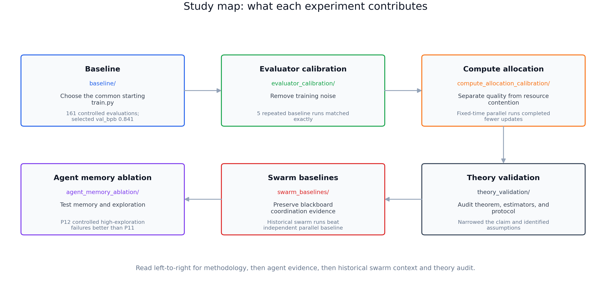

# Studies

This directory is the empirical spine of Agent Workflow Evaluation Lab. Each
folder is one evidence bundle: a question, what was run, the result, the caveat,
and the file a reviewer should read first.

## Reading Order

1. [`baseline/`](baseline/) - selects the common starting `train.py`.
2. [`evaluator_calibration/`](evaluator_calibration/) - proves the evaluator can
   be made deterministic.
3. [`compute_allocation_calibration/`](compute_allocation_calibration/) - shows
   why fixed-time parallel evaluation can confound quality with compute.
4. [`agent_memory_ablation/`](agent_memory_ablation/) - tests memory and
   exploration in agent workflows.
5. [`swarm_baselines/`](swarm_baselines/) - preserves historical blackboard
   swarm evidence.
6. [`theory_validation/`](theory_validation/) - audits the mathematical frame
   and estimator assumptions.

For a compact table of every experiment bundle, read
[`experiment_catalog.md`](experiment_catalog.md).

## Experiment Bundles

| Study | Role | What was run | Main result | Read first |
| --- | --- | --- | --- | --- |
| [`baseline/`](baseline/) | Starting point calibration | 161 controlled evaluations of candidate starting models and edits | selected starting model: `val_bpb = 0.841354`, target `<= 0.824` | [`baseline/README.md`](baseline/README.md) |
| [`evaluator_calibration/`](evaluator_calibration/) | Deterministic evaluator | fixed-step baseline verification plus memory/no-memory calibration reps | five repeated baseline runs produced identical `val_bpb = 0.811222` | [`evaluator_calibration/README.md`](evaluator_calibration/README.md) |
| [`compute_allocation_calibration/`](compute_allocation_calibration/) | Compute fairness | fixed-time CPU scaling, fixed-step pair benchmark, archived 2x2 pilot | fixed-time parallel workers completed fewer optimizer updates; fixed-step held quality constant and exposed latency | [`compute_allocation_calibration/README.md`](compute_allocation_calibration/README.md) |
| [`agent_memory_ablation/`](agent_memory_ablation/) | Current agentic signal | 16 executed probes, 293 valid training runs, memory/exploration/seeding variations | shared memory stabilized high exploration: P12 best `0.914`, mean `1.049` vs P11 best `0.934`, mean `1.816` | [`agent_memory_ablation/README.md`](agent_memory_ablation/README.md) |
| [`swarm_baselines/`](swarm_baselines/) | Historical swarm context | two-agent blackboard swarm runs and model comparisons | preserved swarm runs reached lower `val_bpb` than independent parallel baseline | [`swarm_baselines/README.md`](swarm_baselines/README.md) |
| [`theory_validation/`](theory_validation/) | Theory/protocol audit | theorem review, estimator audit, Jensen/noise checks, context-pressure analysis | narrowed the theoretical claim and documented assumptions still needed for validation | [`theory_validation/README.md`](theory_validation/README.md) |

## Vocabulary

- **Study**: one evidence bundle under `studies/`.
- **Probe**: one configuration inside the agent-memory ablation matrix. Labels
  such as `P11` and `P12` are retained because they identify exact experimental
  cells.
- **Wave**: an execution batch inside a study. It is scheduling metadata, not a
  public milestone.
- **Successful training attempt**: a run that produced a valid evaluator result,
  not a separate experiment.
- **Confirmatory run**: a future run with fixed-step evaluation, preserved raw
  logs, and a pre-registered success threshold.

## Completeness

The public tree keeps curated summaries, result tables, and figures. Raw run
directories, transient agent workspaces, local datasets, and large private logs
are intentionally left out unless a study explicitly says otherwise.
