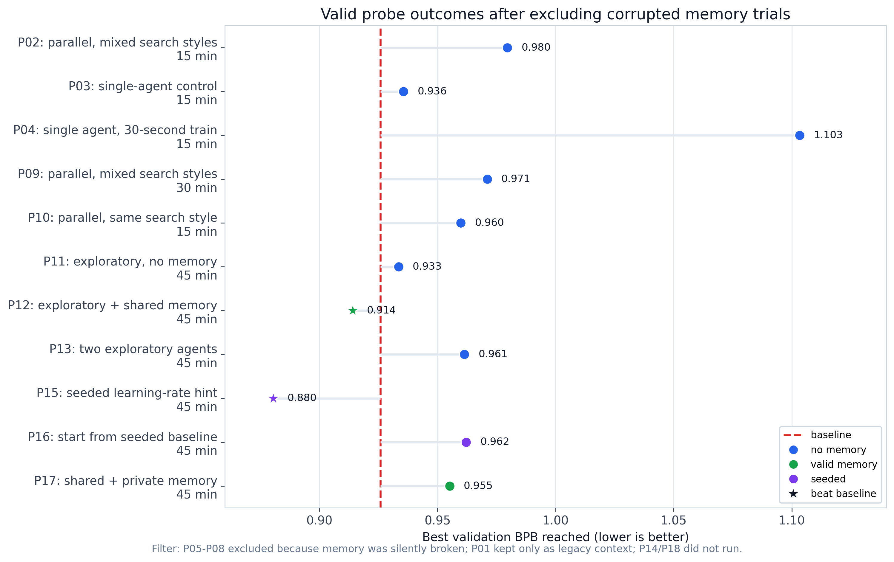
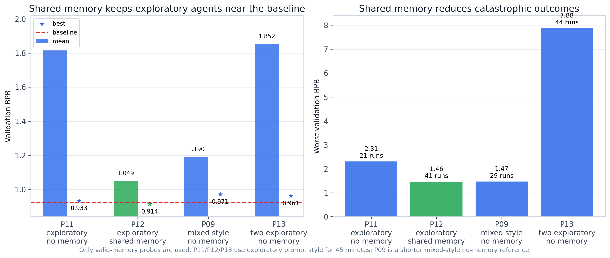
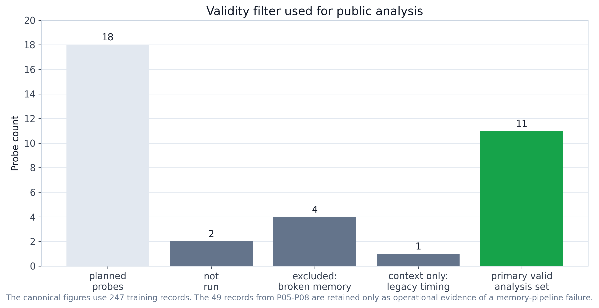

# Agent Memory Ablation

**Status**: active evidence study
**Period**: April 2026
**Question**: when agents explore aggressively, does shared memory make their
search more reliable?

## Task

Each probe runs Claude Haiku agents on the AutoResearch CIFAR-10 task. Agents
edit one training script, launch short training attempts, and try to lower
validation BPB.

In this runtime, `val_bpb` is the validation-loss value parsed by the existing
agent framework. Lower is better. The deterministic baseline to beat in this
study is `val_bpb = 0.925845`.

This baseline matters because the task is intentionally hard but not impossible:
the starting script is already strong, so most edits make it worse. A useful
agent workflow should avoid repeated harmful edits, not merely generate many
attempts.

## Workflow Conditions

The probe matrix varies four workflow choices:

- one agent vs two parallel agents;
- no memory, private memory, shared memory, or both;
- conservative/default/exploratory search style;
- seeded learning-rate hints vs no seeded hint.

**No memory** means the agent sees the current task prompt and workspace only.

**Private memory** means the agent receives a summary of its own previous
attempts. It is agent-local: another agent cannot read it.

**Shared memory** means parallel agents write to and read from the same
append-only results log. It acts like a small blackboard: failed edits,
successful edits, and best observed metrics can be visible to both agents.

The historical configs used the word `temperature`, but the current Claude CLI
does not expose a real sampling-temperature flag. In this repo, values such as
`0.3`, `1.2`, or `1.5` are implemented as **prompt-level search-style
directives**: low values ask for conservative edits, high values ask for broader
exploration, and `null` leaves Claude at default behavior.

## Validity Filter

The planned matrix had 18 probes, `P01` through `P18`.

The canonical analysis uses 11 valid primary probes:

`P02`, `P03`, `P04`, `P09`, `P10`, `P11`, `P12`, `P13`, `P15`, `P16`, `P17`.

These probes contribute 247 training records to the public figures.

Excluded from canonical analysis:

- `P05`-`P08`: memory was configured but silently broken, so these are not valid
  memory tests.
- `P01`: useful historical context, but it used an older training template that
  ran about 315 seconds per attempt instead of the later 60-second evaluator.
- `P14` and `P18`: planned cells that did not run.

The `P05`-`P08` records are preserved in archived analysis files because they
are operational evidence of a real pipeline failure. They should not be used to
claim that private or shared memory helped.

The valid shared-memory probes are primarily `P12` and `P17`.

## Main Result

The clearest comparison is `P11` vs `P12`:

| Probe | Condition | Runs | Best `val_bpb` | Mean `val_bpb` | Worst `val_bpb` |
| --- | --- | ---: | ---: | ---: | ---: |
| `P11` | exploratory search, no memory | 21 | 0.933 | 1.816 | 2.305 |
| `P12` | exploratory search, shared memory | 41 | 0.914 | 1.049 | 1.462 |

The interpretation is narrow but important: shared memory did not solve the
task, but it kept exploratory agents from repeatedly damaging the solution. In
this substrate, shared memory acts mostly as variance reduction and failure
avoidance.

`P17` tested shared plus private memory and did not improve over `P12`. That
suggests private memory is not automatically useful here; it may constrain
exploration or duplicate information already present in the shared log.

## Figures

**Figure 1**: best validation BPB reached by valid primary probes only. `P05`-
`P08` are intentionally absent because their memory mechanism was broken.

**Figure 2**: the core result. With exploratory search, `P12` stays much closer
to the baseline than no-memory controls and avoids the worst regressions.

**Figure 3**: the data filter used for public analysis. Corrupted memory trials
are retained as archival evidence, not plotted as valid outcomes.

## Important Caveats

This is a probing study, not a confirmatory benchmark. Each probe has one
execution, so results are best read as signal detection.

The raw `runs/experiment_probe_P*/` directories and original probe YAML configs
are not included in this public tree. The preserved evidence is the derived JSON
tables, summary reports, and figures under `results/`.

The archived reports still mention the historical 293 executed records. The
public narrative and figures use the stricter 247-record valid-analysis set.

## Evidence Files

- `results/probe_ablation_summary.md`: detailed historical narrative with a
  validity note at the top.
- `results/validity_filter.md`: canonical list of valid, excluded, context-only,
  and not-run probes.
- `results/probe_ablation/analysis/probe_wave1_2_3_4_results.json`: structured
  probe-level metrics, including archived excluded probes.
- `results/probe_ablation/analysis/analysis-report.md`: archived compact
  analysis report.
- `results/probe_ablation/analysis/stats-appendix.md`: archived statistical
  appendix.
- `results/probe_ablation/figures/design_audit/`: archived design-audit figures.
- `../../scripts/plot_agent_memory_ablation.py`: public figure generator.
