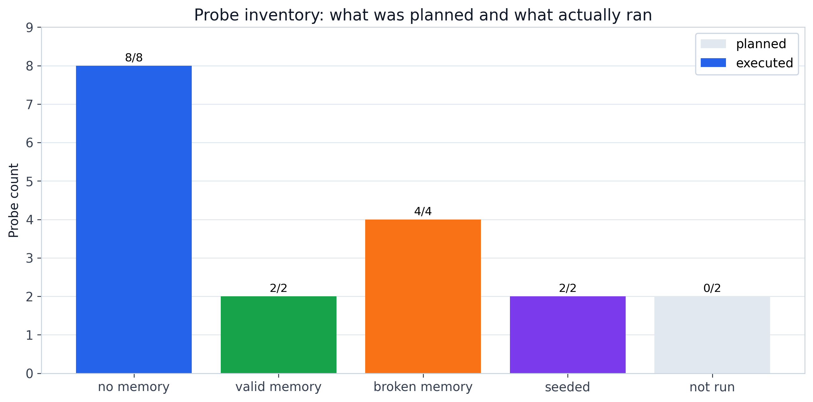

# Agent Memory Ablation

**Status**: active evidence study
**Period**: April 2026
**Question**: when agents explore aggressively, does shared memory make their
search more reliable?

## Task

Each probe runs Claude Haiku agents on the AutoResearch task. Agents edit
`train.py`, launch short training attempts, and try to lower validation BPB.
Lower `val_bpb` is better. The deterministic baseline to beat in this study is
`val_bpb = 0.925845`.

The study varies four workflow choices:

- one agent vs two parallel agents;
- no memory, private memory, shared memory, or both;
- lower/default/high exploration settings;
- seeded hints vs no seeded hint.

## What Was Run

The planned matrix had 18 probes, `P01` through `P18`. Sixteen probes produced
usable results; `P14` and `P18` are preserved as planned-but-not-run cells.

The executed probes produced 293 valid training attempts. This is a probing
study, not a confirmatory benchmark: each probe has one execution, so the
statistics are run-level and should be treated as signal detection.

## Main Result

The clearest comparison is `P11` vs `P12`:

- `P11`: high exploration, no memory. It completed 21 runs, reached best
  `val_bpb = 0.933`, and had mean `val_bpb = 1.816`.
- `P12`: high exploration with shared memory. It completed 41 runs, reached best
  `val_bpb = 0.914`, and had mean `val_bpb = 1.049`.

The interpretation is narrow but important: shared memory did not magically
solve the task, but it kept high-exploration agents from repeatedly damaging the
solution. In this substrate, memory acts mostly as variance reduction and
failure avoidance.

## Figures

**Figure 1**: best validation BPB reached by every planned probe. Stars beat the
baseline. Orange probes had memory configured, but the memory mechanism was
later found to be broken.

**Figure 2**: the core result. `P12` has shared memory and stays much closer to
the baseline than high-exploration no-memory probes.

**Figure 3**: what was planned and what actually ran.

## Important Caveats

Memory was silently broken in early probes `P05`-`P08`. Those cells are useful
operational evidence, but they should not be interpreted as valid memory tests.
The valid shared-memory probes are primarily `P12` and `P17`.

The task has a strong ceiling effect. Only about 1.9 percent of non-baseline
training attempts beat the baseline. Most successful changes were learning-rate
adjustments, so this study supports a reliability claim more than a discovery
claim.

The raw `runs/experiment_probe_P*/` directories and original probe YAML configs
are not included in this public tree. The preserved evidence is the derived
JSON tables, summary reports, and figures under `results/`.

## Evidence Files

- `results/probe_ablation_summary.md`: detailed narrative summary.
- `results/probe_ablation/analysis/probe_wave1_2_3_4_results.json`: structured
  probe-level metrics.
- `results/probe_ablation/analysis/analysis-report.md`: compact analysis report.
- `results/probe_ablation/analysis/stats-appendix.md`: statistical appendix.
- `results/probe_ablation/figures/design_audit/`: archived design-audit figures.
- `../../scripts/plot_agent_memory_ablation.py`: public figure generator.
